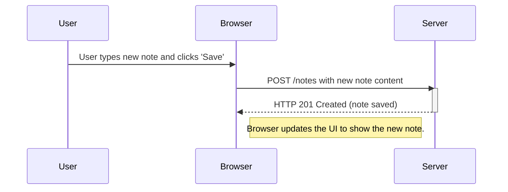

```mermaid
sequenceDiagram
    participant user as User
    participant browser as Browser
    participant server as Server

    user->>browser: User types new note and clicks 'Save'

    browser->>server: POST /notes with new note content
    activate server
    server-->>browser: HTTP 201 Created (note saved)
    deactivate server

    Note right of browser: Browser updates the UI to show the new note.
```
