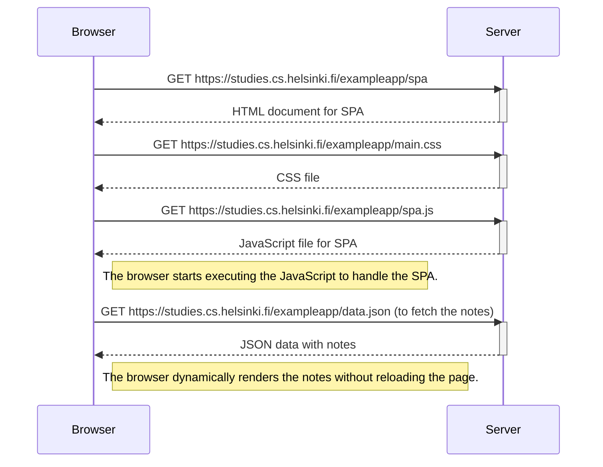

```mermaid
sequenceDiagram
    participant browser as Browser
    participant server as Server

    browser->>server: GET https://studies.cs.helsinki.fi/exampleapp/spa
    activate server
    server-->>browser: HTML document for SPA
    deactivate server

    browser->>server: GET https://studies.cs.helsinki.fi/exampleapp/main.css
    activate server
    server-->>browser: CSS file
    deactivate server

    browser->>server: GET https://studies.cs.helsinki.fi/exampleapp/spa.js
    activate server
    server-->>browser: JavaScript file for SPA
    deactivate server

    Note right of browser: The browser starts executing the JavaScript to handle the SPA.

    browser->>server: GET https://studies.cs.helsinki.fi/exampleapp/data.json (to fetch the notes)
    activate server
    server-->>browser: JSON data with notes
    deactivate server

    Note right of browser: The browser dynamically renders the notes without reloading the page.
```
