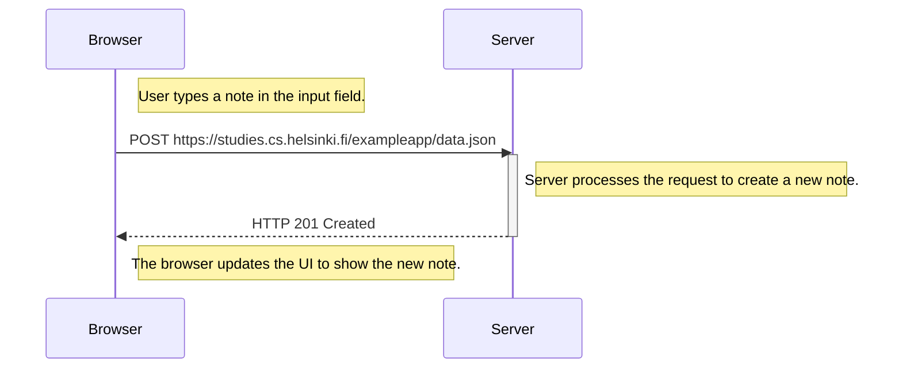

```mermaid
sequenceDiagram
    participant browser as Browser
    participant server as Server

    Note right of browser: User types a note in the input field.

    browser->>server: POST https://studies.cs.helsinki.fi/exampleapp/data.json
    activate server
    Note right of server: Server processes the request to create a new note.

    server-->>browser: HTTP 201 Created
    deactivate server

    Note right of browser: The browser updates the UI to show the new note.
```
